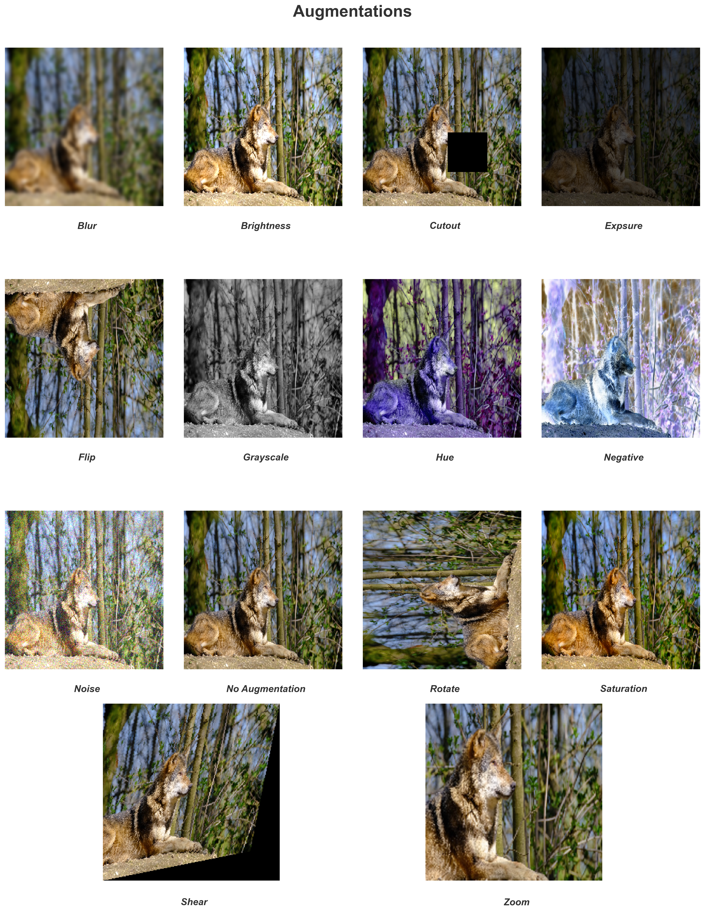

# CVAugmentor
<div align="center" style="display: flex; gap: 10px; flex-wrap: wrap; margin-bottom: 10px;">
    
    
    
</div>
<div align="center" style="display: flex; gap: 10px; flex-wrap: wrap;">
    <a href="https://pepy.tech/projects/cvaugmentor">
        
    </a>
    
    
</div>
<br/>
<div align="center">
  
</div>
<br/>

CVAugmentor is a Python package designed for augmenting images and videos, making it easier to enhance and modify visual data for computer vision tasks. It provides a collection of utilities that automate transformations such as flipping, rotation, scaling, color adjustments, and more.

Available augmentations are:

- no_augmentation
- flip
- zoom
- rotate
- shear
- grayscale
- hue
- saturation
- brightness
- exposure
- blur
- noise
- cutout
- negative

## Installation

This package is built with **Python 3.12.8**.

The simplest way to install it is via pip. Run the following command:
```bash
pip install CVAugmentor
```

Alternatively, you can install it manually by cloning the repository and running the installation. Use the following steps:
```bash
git clone git@github.com:AliKHaliliT/CVAugmentor.git  # With SSH
cd CVAugmentor
pip install .
```
## Usage
For a comprehensive guide on how to use the package, please refer to the [documentation](https://alikhalilit.github.io/CVAugmentor/).

The provided pipeline should be sufficient for most use cases:
```python
from CVAugmentor import Pipeline


p = Pipeline()
```

If you require custom functionality, you can also import the augmentations directly:
```python
from CVAugmentor.assets.augmentations._blur import Blur


blur_instance = Blur()
```

### Examples
#### Single Image Augmentation
```python
from CVAugmentor import Augmentations as aug
from CVAugmentor import Pipeline


## Define the augmentations
augmentations = {
    "blur": aug.Blur(2.5),
    "brightness": aug.Brightness(0.25),
    "cutout": aug.Cutout(max_size=64, max_count=6),
    "expsure": aug.Exposure(0.3),
    "flip": aug.Flip(),
    "grayscale": aug.Grayscale(),
    "hue": aug.Hue(-360),
    "negative": aug.Negative(),
    "no_augmentation": aug.NoAugmentation(),
    "noise": aug.Noise(0.4),
    "rotate": aug.Rotate(),
    "saturation": aug.Saturation(0.5),
    "shear": aug.Shear((0.2, 0.2)),
    "zoom": aug.Zoom(),
}


## Create a Pipeline object
p = Pipeline()

## Augment the image
p.augment(input_path="local_util_resources/samples/images/0.png", 
          output_path="local_util_resources/experiments/single_image/0.png", 
          target="image", 
          process_type="single", 
          mode="sequential", 
          augmentations=augmentations, 
          aug_verbose=True)
```

#### Single Video Augmentation
```python
from CVAugmentor import Augmentations as aug
from CVAugmentor import Pipeline


## Define the augmentations
augmentations = {
    "blur": aug.Blur(2.5),
    "brightness": aug.Brightness(0.25),
    "cutout": aug.Cutout(max_size=64, max_count=6),
    "expsure": aug.Exposure(0.3),
    "flip": aug.Flip(),
    "grayscale": aug.Grayscale(),
    "hue": aug.Hue(-360),
    "negative": aug.Negative(),
    "no_augmentation": aug.NoAugmentation(),
    "noise": aug.Noise(0.4),
    "rotate": aug.Rotate(),
    "saturation": aug.Saturation(0.5),
    "shear": aug.Shear((0.2, 0.2)),
    "zoom": aug.Zoom(),
}


## Create a Pipeline object
p = Pipeline()

## Augment the video
p.augment(input_path="local_util_resources/samples/videos/0.mp4", 
          output_path="local_util_resources/experiments/single_video/0.mp4", 
          target="video", 
          process_type="single", 
          mode="singular", 
          augmentations=augmentations, 
          aug_verbose=True)
```

#### Augmenting Multiple Images
```python
from CVAugmentor import Augmentations as aug
from CVAugmentor import Pipeline


## Define the augmentations
augmentations = {
    "blur": aug.Blur(),
    "brightness": aug.Brightness(),
    "cutout": aug.Cutout(),
    "expsure": aug.Exposure(),
    "flip": aug.Flip(),
    "grayscale": aug.Grayscale(),
    "hue": aug.Hue(),
    "negative": aug.Negative(),
    "no_augmentation": aug.NoAugmentation(),
    "noise": aug.Noise(),
    "rotate": aug.Rotate(),
    "saturation": aug.Saturation(),
    "shear": aug.Shear(),
    "zoom": aug.Zoom(),
}


## Create a Pipeline object
p = Pipeline()

## Augment the images
p.augment(input_path="local_util_resources/samples/images", 
          output_path="local_util_resources/experiments/multi_image", 
          target="image", 
          process_type="batch", 
          mode="singular", 
          augmentations=augmentations, 
          verbose=True, 
          warn_verbose=True,
          random_state=True)
```

#### Augmenting Multiple Videos
```python
from CVAugmentor import Augmentations as aug
from CVAugmentor import Pipeline


## Define the augmentations
augmentations = {
    "blur": aug.Blur(),
    "brightness": aug.Brightness(),
    "cutout": aug.Cutout(),
    "expsure": aug.Exposure(),
    "flip": aug.Flip(),
    "grayscale": aug.Grayscale(),
    "hue": aug.Hue(),
    "negative": aug.Negative(),
    "no_augmentation": aug.NoAugmentation(),
    "noise": aug.Noise(),
    "rotate": aug.Rotate(),
    "saturation": aug.Saturation(),
    "shear": aug.Shear(),
    "zoom": aug.Zoom(),
}


## Create a Pipeline object
p = Pipeline()

## Augment the videos
p.augment(input_path="local_util_resources/samples/videos", 
          output_path="local_util_resources/experiments/multi_video", 
          target="video", 
          process_type="batch", 
          mode="singular", 
          augmentations=augmentations, 
          verbose=True, 
          aug_verbose=True,
          warn_verbose=True,
          random_state=True)
```

## License
This work is under an [MIT](https://choosealicense.com/licenses/mit/) License.